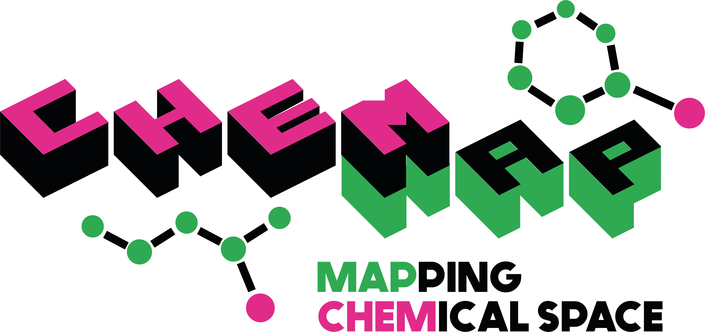

[](https://pypi.org/project/chemap/)

[](https://www.rdkit.org/)
    
# chemap - Mapping chemical space
Library for computing molecular fingerprint based similarities as well as dimensionality reduction based chemical space visualizations.

## Installation
`chemap` can be installed using pip.
```bash
pip install chemap
```
Or, to include UMAP computation abilities on either CPU or GPU chose one of the following option:
- CPU version: ```pip install "chemap[cpu]"```
- GPU version (CUDA 12): ```pip install "chemap[gpu-cu12]"```
- GPU version (CUDA 13): ```pip install "chemap[gpu-cu13]"```

## Fingerprint computations (choose from  `RDKit` or `scikit-fingerprints`)
Fingerprints can be computed using generators from `RDKit` or `scikit-fingerprints`. 
This includes popular fingerprint types such as:

### Path-based and circular fingerprints
- RDKit fingerprints
- Morgan fingerprints
- FCFP fingerprints
- ...

### Predefined substructure fingerprints
- MACCS fingerprints
- PubChem fingerprints
- Klekota-Roth fingerprints
- ...

### Topological distance based fingerprints
- Atom pair fingerprints


## Fingerprint computations II (implemtations in `chemap`)
Due to some existing limitations with present implementations, chemap also provides some fingerprint generator.
Those allow to generate folded as well as unfolded fingerprints, each either as binary or count variant.

- MAP4 fingerprint --> `from chemap.fingerprints import MAP4Gen`
- Lingo fingerprint --> `from chemap.fingerprints import LingoFingerprint`

And, not really a fingerprint in the classical sense, but usefull as a baseline for benchmarking tasks (or as an additional component of a fingerprint), chemap provides a
simple element count vector/fingerprint. This does nothing more than simply count the number of H's, C's, O's etc.
- ElementCount fingerprint --> `from chemap.fingerprints import ElementCountFingerprint`


Here a code example:

```python
import numpy as np
import scipy.sparse as sp
from rdkit.Chem import rdFingerprintGenerator
from skfp.fingerprints import MAPFingerprint, AtomPairFingerprint

from chemap import compute_fingerprints, DatasetLoader, FingerprintConfig


ds_loader = DatasetLoader()
# Load a single dataset from a local file
smiles = ds_loader.load("tests/data/smiles.csv")
# or load a dataset collection from a DOI based registry (e.g., Zenodo)
files = ds_loader.load_collection("10.5281/zenodo.18682050")
# pass one of the absolute file paths from files
smiles = ds_loader.load(files[0])

# ----------------------------
# RDKit: Morgan (folded, dense)
# ----------------------------
morgan = rdFingerprintGenerator.GetMorganGenerator(radius=3, fpSize=4096)
X_morgan = compute_fingerprints(
    smiles,
    morgan,
    config=FingerprintConfig(
        count=False,
        folded=True,
        return_csr=False,   # dense numpy
        invalid_policy="raise",
    ),
)
print("RDKit Morgan:", X_morgan.shape, X_morgan.dtype)

# -----------------------------------
# RDKit: RDKitFP (folded, CSR sparse)
# -----------------------------------
rdkitfp = rdFingerprintGenerator.GetRDKitFPGenerator(fpSize=4096)
X_rdkitfp_csr = compute_fingerprints(
    smiles,
    rdkitfp,
    config=FingerprintConfig(
        count=False,
        folded=True,
        return_csr=True,    # SciPy CSR
        invalid_policy="raise",
    ),
)
assert sp.issparse(X_rdkitfp_csr)
print("RDKit RDKitFP (CSR):", X_rdkitfp_csr.shape, X_rdkitfp_csr.dtype, "nnz=", X_rdkitfp_csr.nnz)

# --------------------------------------------------
# scikit-fingerprints: MAPFingerprint (folded, dense)
# --------------------------------------------------
# MAPFingerprint is a MinHash-like fingerprint (different from MAP4 lib).
map_fp = MAPFingerprint(fp_size=4096, count=False, sparse=False)
X_map = compute_fingerprints(
    smiles,
    map_fp,
    config=FingerprintConfig(
        count=False,
        folded=True,
        return_csr=False,
        invalid_policy="raise",
    ),
)
print("skfp MAPFingerprint:", X_map.shape, X_map.dtype)

# ----------------------------------------------------
# scikit-fingerprints: AtomPairFingerprint (folded, CSR)
# ----------------------------------------------------
atom_pair = AtomPairFingerprint(fp_size=4096, count=False, sparse=False, use_3D=False)
X_ap_csr = compute_fingerprints(
    smiles,
    atom_pair,
    config=FingerprintConfig(
        count=False,
        folded=True,
        return_csr=True,
        invalid_policy="raise",
    ),
)
assert sp.issparse(X_ap_csr)
print("skfp AtomPair (CSR):", X_ap_csr.shape, X_ap_csr.dtype, "nnz=", X_ap_csr.nnz)

# (Optional) convert CSR -> dense if you need a NumPy array downstream:
X_ap = X_ap_csr.toarray().astype(np.float32, copy=False)
```

## UMAP Chemical Space Visualization
`chemap` provides functions to compute UMAP coordinates based on molecular fingerprints.
Depending on your system and installation, this can be either via a very fast `cuml` library by
using `create_chem_space_umap_gpu`, which then only allows to use "cosine" as a metric, as well
as folded/fixed sized fingerprints.
The alternative is a numba-based variant `create_chem_space_umap` (so this is still optimized,
but much slower than the GPU version). While this is slower, it in return allows to use Tanimoto
as a metric and can also handle unfolded fingerprints.

Example:
```python
from rdkit.Chem import rdFingerprintGenerator
from chemap.plotting import create_chem_space_umap, scatter_plot_hierarchical_labels

data_plot = create_chem_space_umap(
    data_compounds,  # dataframe with smiles and class/subclass etc. information
    col_smiles="smiles",
    inplace=False,
    x_col="x",
    y_col="y",
    fpgen = rdFingerprintGenerator.GetMorganGenerator(radius=9, fpSize=4096),
)

# Plot
fig, ax, _, _  = scatter_plot_hierarchical_labels(
    data_plot,
    x_col="x",
    y_col="y",
    superclass_col="Superclass",
    class_col="Class",
    low_superclass_thres=2500,
    low_class_thres=5000,
    max_superclass_size=10_000,
```


